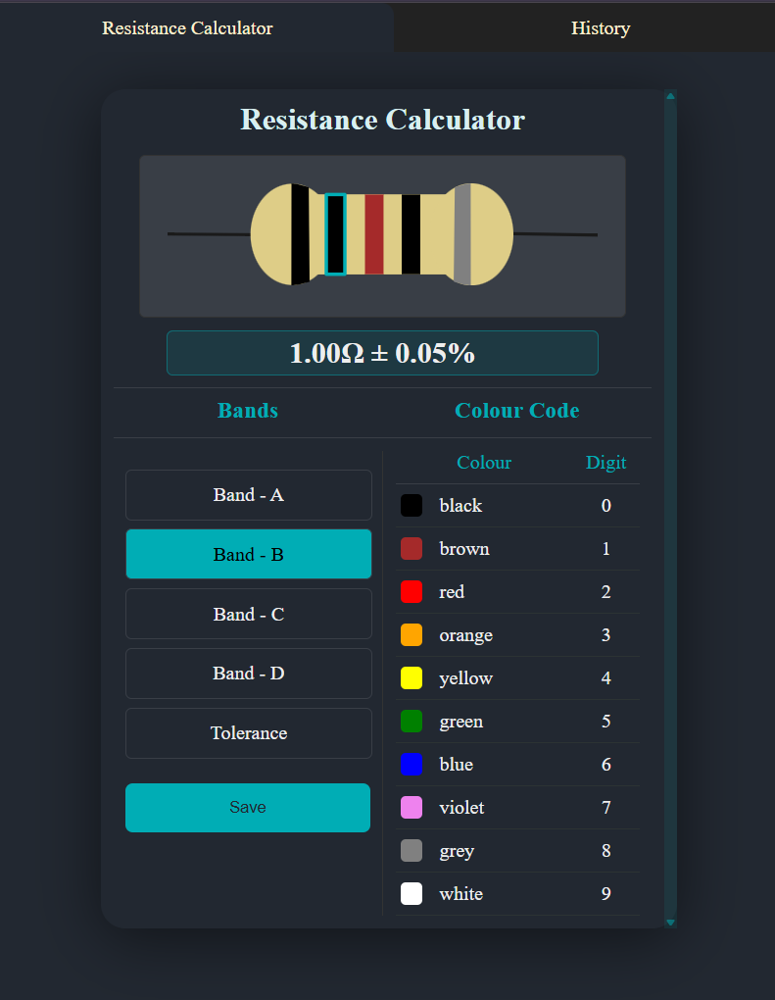
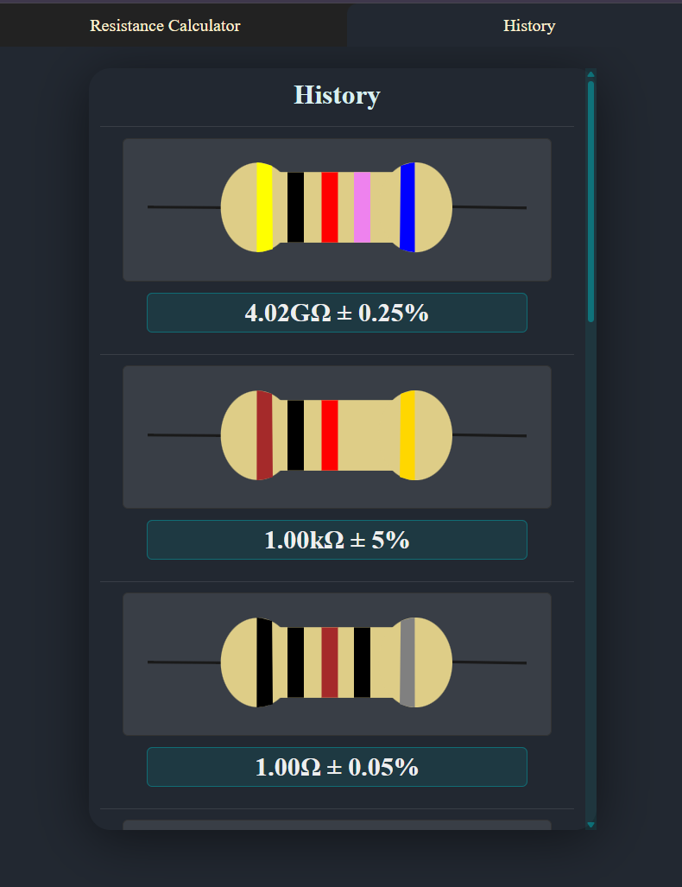
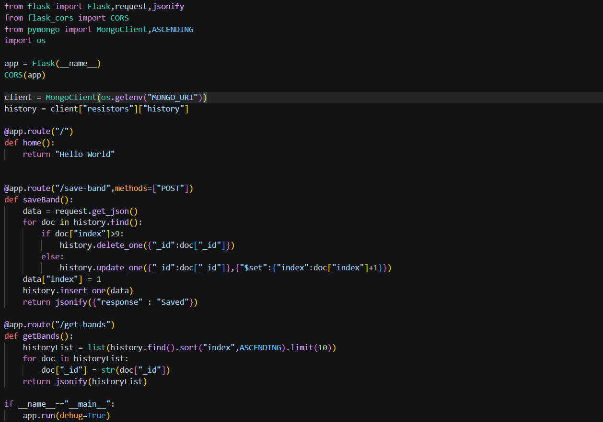

# Resistor_Calculator
A simple webpage that calculates the values of Resistor color codes
## Tech Stack
This project was built using: 
Frontend : React 
Backend : Flask 
DataBase : MongoDB 
Deployement : Github Pages(frontend) 
            : Render(Backend) 
            : MongoDB Atlas(Database) 
These are the main technologies I used to build the frontend, backend, database and deployement for this project 
## WebPage & Code Snippets
### CalculatorPage:

### HistoryPage:

### Flask:

